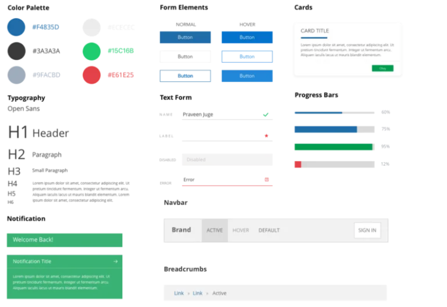

# Design System

O Design System é um sistema unificado que inclui elementos, componentes, regras e princípios para guiar o desenvolvimento de interfaces de uma empresa, proporcionando consistência e padronização nos produtos digitais. Serve como uma ferramenta de suporte para designers e desenvolvedores, garantindo uma aparência consistente e reconhecível dos produtos. Sem ele, podem ocorrer retrabalhos e inconsistências, resultando em perda de tempo. Nathan Curtis descreve o Design System como "um produto servindo outros produtos", destacando sua importância em manter a consistência e agilizar o trabalho das equipes de Design e Tecnologia. É crucial para empresas que buscam maior integração de ideias no desenvolvimento de produtos.

O Design System possui 5 elementos básicos que não podem faltar. São eles:

1. Propósito e Valores;
2. Princípios de Design;
3. Identidade da Marca;
4. Componentes, padrões e elementos;
5. Diretrizes e regras de uso.

<figure><figcaption></figcaption></figure>

**E como começar?**

**Discovery:** Inicia-se conhecendo a marca, seus valores e pessoas. Analisa-se projetos existentes para entender como serão influenciados pelo novo Design System.

**Design:** Após absorver feedbacks de designers, stakeholders e usuários, são identificados os princípios do Design System, que representam os objetivos macro. Esses princípios são baseados nos problemas identificados e no propósito do sistema.

**Desenvolvimento:** É essencial alinhar as expectativas da equipe de front-end, responsável por codificar os componentes do sistema. O Design System precisa ser codificado para se manter relevante. A colaboração entre designers e desenvolvedores é crucial.

**Documentação:** Uma vez definido o Design System, é importante criar uma documentação acessível para que designers, desenvolvedores e stakeholders saibam como utilizá-lo. Essa documentação deve ser disponibilizada em um local acessível a todos os envolvidos.

\
**Atomic Design**

O _Atomic Design_ é uma metodologia desenvolvida por Brad Frost em 2013 para a criação de _design systems_. Ela é composta por cinco estágios, trabalhando juntos para criar interfaces de maneira simples e hierárquica. Os cinco estágios são: átomos, moléculas, organismos, _templates_ (ou modelos) e páginas.

Nesse modelo, os átomos são como os botões e links de um _design system_, e as moléculas, quando agrupadas, formam os organismos que dão origem aos _templates_. Esses, por sua vez, formam as páginas.

<figure><figcaption></figcaption></figure>

<figure><figcaption></figcaption></figure>

**E quando os Design Tokens entram em ação?**

_Design Tokens_ são um arquivo central que contém todos os elementos fundamentais de design como: fontes, espaçamento, cores, borda, ícones, entre outros. Os _design tokens_ se inserem como os ‘elétrons’, ou seja, partículas subatômicas que guardam as propriedades e atributos de cada ‘átomo’ da interface em variáveis. Uma vez que é feita uma mudança na cor primária, por exemplo, de um elemento, ela é propagada pra todo _website_ ou aplicação mobile, sem a necessidade de checar o código.

**E ai, conseguiu entender o design token?**

De forma resumida, _Design Tokens_ são atributos visuais de design:

* Comunicação (através de variáveis nomeadas);
* Consistência através de tecnologias e plataformas;
* Reutilização;
* Fácil manutenção;

E que visam:

* Armazenáveis;
* Organizados;
* Centralizados;
* Propagáveis;

\
